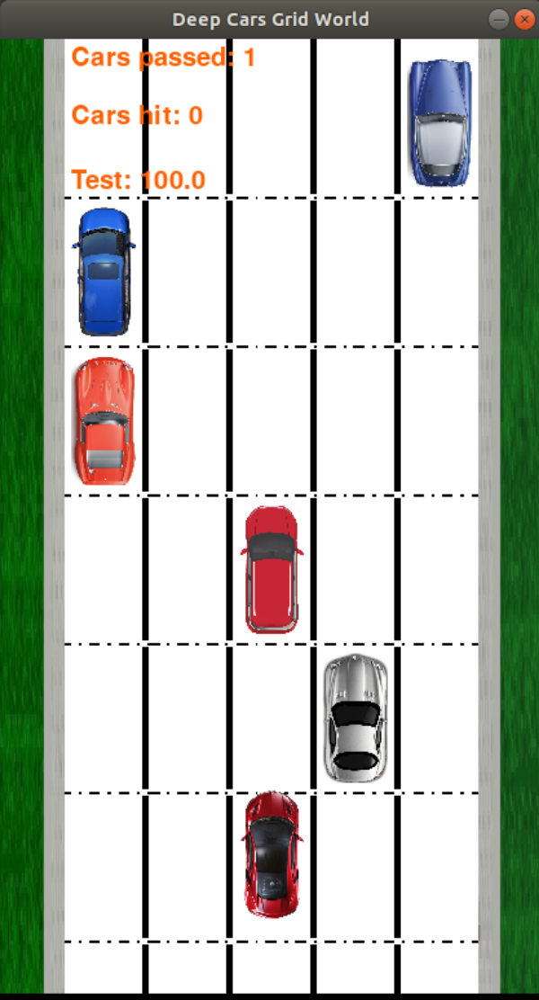

[DeepCars](https://github.com/MajidMoghadam2006/gym-deepcars) is a simple highway traffic simulator for training Reinforcement Learning agents to perform the high-level decision making on self-driving cars. Here we provided two Deep Reinforcement Learning (DRL) agents DQN and Double-DQN in DeepCars environment where the observations space is occupancy grid of the environment and the action space is left, stay, and right which move the agent to the corresponding lane on the next step. 



Install requirements:

```ruby
pip install -r requirements.txt
pip install -e .
```

Run training for Double-DQN:

```ruby
python3 Train_DeepCars_DDQN.py
```

Run evaluation for trained model using Double-DQN:

```ruby
python3 Test_DeepCars_DDQN.py
```

Run training for DQN:

```ruby
python3 Train_DeepCars_DQN.py
```

Run evaluation for trained model using DQN:

```ruby
python3 Test_DeepCars_DQN.py
```


To cite our [ArXiv paper](https://arxiv.org/abs/1906.08464) presented in [ICML RWSDM 2019](https://realworld-sdm.github.io/) workshop you may use the following BibTeX entry:

```
@misc{moghadam2019hierarchical,
    title={A Hierarchical Architecture for Sequential Decision-Making in Autonomous Driving using Deep Reinforcement Learning},
    author={Majid Moghadam and Gabriel Hugh Elkaim},
    year={2019},
    eprint={1906.08464},
    archivePrefix={arXiv},
    primaryClass={cs.RO}
}
```
